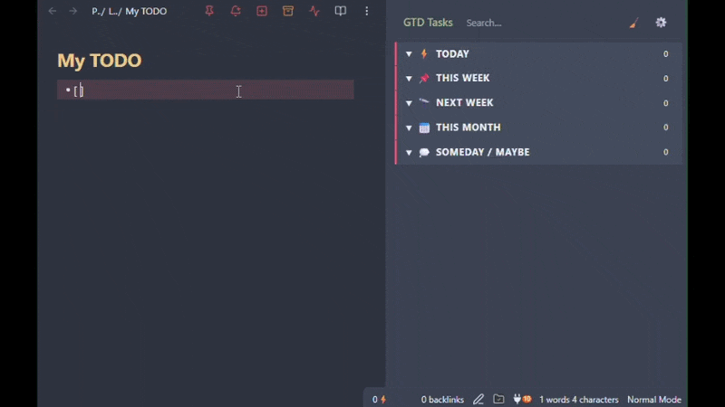

# GTD Tasks

An [Obsidian](https://obsidian.md) plugin that organizes your markdown tasks using the **Getting Things Done** methodology. Tasks are grouped into time-horizon buckets (Today, This Week, Someday…) in a sidebar panel, with one-click moves between buckets.




---

## Features

- **GTD time-horizon buckets** — Today ⚡, This Week 📌, Next Week 🔭, This Month 📅, Someday / Maybe 💭
- **To Review inbox** 📥 — catches all unassigned tasks so nothing slips through
- **One-click quick-move buttons** on every task row
- **Drag-and-drop** reordering and cross-bucket moves
- **Context menu** (right-click) for moving tasks
- **Subtask-aware**: indented child tasks are tracked separately, with an active-subtask count badge and a prompt to move them along with their parent
- **Search**: filter the panel down to matching tasks
- **Checkbox completion** with optional celebration animations (confetti, pixel creature, both, or off)
- **Tasks plugin integration** — reads 📅 due dates and auto-assigns tasks to the matching bucket
- **Two storage modes** — inline tag (`#gtd/today`) or inline field (`[gtd:: today]`)
- **Scope filtering** — scan the entire vault, specific folders, or specific files
- **Stale indicator** (!) on tasks that have passed their scheduled window
- **Status bar task count**
- **Compact view** option
- **Localized** into 13 languages, matching your Obsidian UI language automatically
- Fully **customizable buckets** — name, emoji, date range rule, quick-move targets

---

## Default Buckets

| Bucket | Emoji | Date rule |
|---|---|---|
| To Review | 📥 | Unassigned tasks (system bucket) |
| Today | ⚡ | Due today |
| This Week | 📌 | Tomorrow → end of this week |
| Next Week | 🔭 | Next Monday → following Sunday |
| This Month | 📅 | This week → end of this calendar month |
| Someday / Maybe | 💭 | No date rule (manual only) |

---

## Installation

### Community Plugins (once listed)

1. Open Obsidian → **Settings → Community plugins → Browse**
2. Search for **GTD Tasks**
3. Click **Install**, then **Enable**

### BRAT (beta / pre-release)

1. Install the [BRAT](https://github.com/TfTHacker/obsidian42-brat) community plugin
2. In BRAT settings, click **Add Beta Plugin** and enter:
   ```
   Unpreditable/GettingThingsDone
   ```
3. Enable GTD Tasks in **Community plugins**

---

## Usage

### Open the panel

Click the checklist icon in the left ribbon, or run **Open GTD Panel** from the Command Palette (`Ctrl/Cmd + P`).

### Complete a task

Click the checkbox on any task row. A celebration animation plays (if enabled). The task is struck through and stays visible until midnight by default (adjustable in settings), then disappears on next load. You can also dismiss all completed tasks early with the broom icon in the panel header.

### Move a task

Three ways to move a task to a different bucket:

| Method | How |
|---|---|
| **Quick-move buttons** | Click the small bucket buttons on the right side of the task row |
| **Drag-and-drop** | Drag a task row to any bucket, including collapsed ones |
| **Context menu** | Right-click a task row → **Move to…** |

The plugin writes the assignment back to the source markdown file immediately. If the task has subtasks that each have their own bucket assigned, you'll be asked whether to move them along with it.

### Search

Type in the search box at the top of the panel to filter down to matching tasks. The status line below it shows how many tasks are currently visible; click it (or the × in the search box) to clear the search.

---

## Configuration

Open **Settings → GTD Tasks** to configure the plugin.

### Storage mode

Controls how bucket assignments are stored on the task line:

| Mode | Example |
|---|---|
| **Inline tag** (default) | `- [ ] Buy milk #gtd/today` |
| **Inline field** | `- [ ] Buy milk [gtd:: today]` |

You can migrate all existing assignments between modes from the settings tab.

### Tag prefix

The prefix used in both storage modes. Default: `gtd`. Changing this also changes the tag/field name written to your files.

### Task scope

Limit which files are indexed:

- **Entire vault** — all `*.md` files
- **Specific folders** — enter one or more folder paths
- **Specific files** — enter one or more file paths

### Tasks plugin integration

When enabled, the plugin reads `📅 YYYY-MM-DD` due dates written by the [Tasks](https://github.com/obsidian-tasks-group/obsidian-tasks) community plugin and automatically assigns tasks to the matching time-horizon bucket. Manual assignments (tag/field) always take priority over date-based ones.

### Celebration animations

Choose what plays when you check off a task:

| Setting | Effect |
|---|---|
| **Confetti** (default) | Confetti burst only |
| **Creature** | Pixel creature only |
| **All** | Confetti burst + pixel creature |
| **Off** | No animation |

### Stale indicator

When enabled, a `!` badge appears on tasks whose due date has passed the end of their assigned bucket's scheduled window — a reminder to reschedule or complete them.

### Status bar

Each bucket can optionally show its task count in Obsidian's status bar. Toggle per bucket in the bucket list at the bottom of settings.

### Compact view

Reduces padding on bucket headers and task rows for a denser layout.

---

## Bucket Date Rules

Each bucket can have an optional date range rule that auto-assigns tasks based on their `📅` due date:

| Rule | Covers |
|---|---|
| `today` | Today only |
| `this-week` | Tomorrow through end of this week (Sunday) |
| `next-week` | Next Monday through the following Sunday |
| `this-month` | Remaining days through end of this calendar month |
| `next-month` | First through last day of next calendar month |
| `within-days` | Due within the next N days |
| `within-days-range` | Due between day M and day N from today |
| `beyond-days` | Due more than N days from today (useful for Someday) |

Tasks with no due date and no manual assignment land in **To Review**.

---

## To Review Bucket

The To Review bucket is a permanent system bucket that always appears first in the panel. It collects every task that has no manual assignment and no matching due date rule. Use it as a GTD-style inbox: process tasks from here by moving them into the appropriate time-horizon bucket.

---

## Subtasks

A task indented under another task in your markdown file is tracked as its subtask. Parent rows show an active-subtask count badge, and a subtask that's been moved to a different bucket than its parent gets a small indicator pointing back to it. Moving a parent that has subtasks with their own bucket assignments will ask whether to move those subtasks along with it, or leave them where they are.

---

## Localization

The panel and settings UI are available in German, Spanish, Estonian, French, Japanese, Korean, Lithuanian, Latvian, Portuguese, Russian, Ukrainian, and Chinese, in addition to English, matching Obsidian's UI language automatically. If you change Obsidian's language, default bucket names update to match on next load, with a one-time notice in the panel.

---

## License

[GPL-3.0](LICENSE) © 2026 Vitaly Ditman
