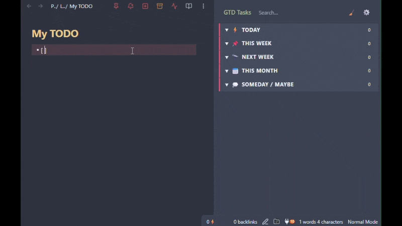

# GTD Tasks

Your tasks are scattered across hundreds of notes. This [Obsidian](https://obsidian.md) plugin gathers them into one sidebar panel, sorted by when you'll actually do them: Today, This Week, Next Week, This Month, Someday (the Getting Things Done time horizons).

Your notes stay the source of truth. A bucket is just a tag on the task line, like `#gtd/today`.

Have the [Tasks](https://community.obsidian.md/plugins/obsidian-tasks-plugin) plugin? The two work together. This panel reads the fields Tasks writes on your task lines and puts them to use.

 
[Report a bug](https://github.com/Unpreditable/GettingThingsDone/issues/new?template=bug-report.yml) · [Request a feature](https://github.com/Unpreditable/GettingThingsDone/issues/new?template=feature-request.yml) · [Ask a question](https://github.com/Unpreditable/GettingThingsDone/discussions/new?category=q-a)

---

## Features

- **Time-horizon buckets** — Today ⚡, This Week 📌, Next Week 🔭, This Month 📅, Someday / Maybe 💭. Rename them, swap the emoji, reorder them, or write your own date rules.
- **To Review inbox** 📥 — every task without a bucket lands here, so nothing slips through.
- **Three ways to move a task** — quick-move buttons on the row, drag-and-drop between buckets, or right-click.
- **Clickable links** — open a web link or a linked note straight from a task, without visiting its note first.
- **Subtask-aware** — indented tasks track with their parent, with a count badge and a prompt to move them along.
- **Overdue and misfiled flags** —  once a due date has passed,  when a task sits in a bucket that will make you miss it.
- **Reads Tasks plugin fields** — due dates, priority, recurrence and the rest show up as badges and on hover.
- **Celebration animations** — confetti, a pixel creature, both, or nothing.
- **13 languages**, matching your Obsidian UI language.

Also: search, scoping to folders or files, Dataview-friendly inline fields, per-bucket status bar counts, and a compact view. See [Configuration](#configuration).

---

## Works with the Tasks plugin

Run both, since they solve different problems.

The [Tasks](https://community.obsidian.md/plugins/obsidian-tasks-plugin) plugin adds structure to a task: a due date, a priority, a repeat rule. It also searches your vault and lists the matching tasks inside a note.

This plugin is for one view you keep open all day. Drag tasks between buckets, or reorder them inside one, and your plan for the day changes in seconds.

### How they work together

The plugin assigns each task to a bucket based on its `📅` due date or `⏳` scheduled date, depending on the **Auto-assignment date** setting. Defaults to scheduled date first, with fallback to due date.

Pin a task (via the right-click menu, a quick-move button, or dragging it to another bucket) to keep it in that bucket and ignore the dates. Unpin (via the right-click menu) to let automatic assignment take over again.

Checking a task off in the panel does what checking it off in the editor does, including the [Tasks](https://community.obsidian.md/plugins/obsidian-tasks-plugin) plugin's recurrence and completion-date setting.

With Tasks installed, right-click a task → **Edit task** to change it in Tasks' own edit dialog; saving writes it back to its note.

The panel also recognises the checkbox statuses that Tasks and many themes use. `[/]` (in progress), `[>]` (forwarded) and `[<]` (scheduled) are open tasks. `[-]` (cancelled) counts as done. If your theme draws its own icons for these, the panel shows them too. Other symbols, such as `[?]` or `[l]`, aren't treated as tasks.

> **As of v0.2.0,** panel completions don't write a `✅` date. Install [Tasks](https://community.obsidian.md/plugins/obsidian-tasks-plugin) if you want one.

---

## Default Buckets

| Bucket | Emoji | Date rule |
|---|---|---|
| To Review | 📥 | Tasks with no date and no pin (system bucket) |
| Today | ⚡ | Today or earlier |
| This Week | 📌 | Tomorrow → end of this week |
| Next Week | 🔭 | All of next week |
| This Month | 📅 | Tomorrow → end of this calendar month |
| Someday / Maybe | 💭 | Everything the buckets above didn't claim |

Weeks run Monday through Sunday by default. Set **First day of the week** in settings if yours starts on another day — it moves the This Week and Next Week boundaries and leaves the other rules alone.

Ranges overlap on purpose — This Month contains This Week. The first bucket from the top whose rule matches wins.

---

## Installation

Open **Settings → Community plugins → Browse**, search for **GTD Tasks**, then click **Install** and **Enable**.

Or add via [Obsidian community plugin page](https://community.obsidian.md/plugins/gtd-tasks).

Beta releases via BRAT

1. Install the <a href=https://github.com/TfTHacker/obsidian42-brat>BRAT</a> community 
2. In BRAT settings, click <b>Add Beta Plugin</b> and enter: <code> Unpreditable/GettingThingsDone </code> 
3. Enable GTD Tasks in <b>Community plugins</b>

---

## Usage

### Open the panel

Click the checklist icon in the left ribbon, or run **Open GTD Panel** from the Command Palette (`Ctrl/Cmd + P`).

### Move a task

Three ways to move a task to a different bucket:

| Method | How |
|---|---|
| **Quick-move buttons** | Click the small bucket buttons on the right side of the task row |
| **Drag-and-drop** | Drag a task row to any bucket, including collapsed ones |
| **Context menu** | Right-click a task row → **Move to…** |

The plugin writes the assignment back to the source markdown file immediately. If the task has subtasks that each have their own bucket assigned, you'll be asked whether to move them along with it.

### Pin a task

Moving a task by hand pins it to that bucket, so its dates no longer move it.

- Right-click → **Pin to Today** to pin a task where it already sits.
- Right-click → **Unpin** to let the task follow its date again.

### Search

Type in the search box at the top of the panel to filter down to matching tasks. The status line below it shows how many tasks are currently visible; click it (or the × in the search box) to clear the search.

---

## Configuration

### Annotation style

Controls how bucket assignments are stored on the task line:

| Mode | Example |
|---|---|
| **Inline tag** (default) | `- [ ] Buy milk #gtd/today` |
| **Inline field** | `- [ ] Buy milk [gtd:: today]` |
You can migrate all existing assignments between modes from the settings tab.

### Tag / field name

The prefix used in both storage modes. Default: `gtd`. Changing this also changes the tag/field name written to your files.

### Files to scan

Choose which files the plugin indexes.

- **Entire vault, except…** scans every `*.md` file except the ones you list.
- **Selected paths only** scans only the folders and files you list.

Add an entry with **+ Add folder**/**+ Exclude folder** or **+ Add file**/**+ Exclude file**.

### Show completed tasks until midnight

Keeps a checked-off task in the panel, struck through, until midnight or until you reload Obsidian, whichever comes first. Clear them sooner with the broom icon in the panel header. Turn the setting off and each task disappears the moment you check it.

Repeating tasks are the exception. Checking one off hides it right away, because its next occurrence is already in the list.

### Flag overdue and misfiled tasks

When enabled, two badges call out tasks that need attention:

-  — the task's `📅` due date has passed.
-  — a bucket higher up is a better placement, and leaving this task as is risks missing it. A task due today but sitting in `This Week` belongs in `Today`.

Neither badge appears on a completed task. Only a `📅` due date makes a task overdue. A `⏳` scheduled date that has passed doesn't. Both can apply at once. The row shows the overdue badge, the more urgent of the two, and hovering the task spells out both reasons along with the bucket the misfiled badge points at.

### Open links from the panel

On by default. Allows clicking links as if from your note.

### Compact view

Reduces padding on bucket headers and task rows for a denser layout.

### Celebration animations

Choose what plays when you check off a task:

| Setting | Effect |
|---|---|
| **Confetti** (default) | Confetti burst only |
| **Creature** | Pixel creature only |
| **All** | Confetti burst + pixel creature |
| **Off** | No animation |

### Auto-assignment date

Controls which date drives bucket assignment and ordering within a bucket.

| Option | Uses |
|---|---|
| **Ignore dates** | Nothing. Every task waits in To Review until you file it |
| **Due** | `📅` only. A task without one stays in To Review |
| **Due, else scheduled** | `📅`, falling back to `⏳` |
| **Scheduled, else due** | `⏳`, falling back to `📅`. The default |
| **Scheduled** | `⏳` only. A task without one stays in To Review |
| **Earliest of the two** | Whichever comes first |

Pinned tasks ignore this setting.

### Tasks plugin fields

Control how the [Tasks](https://community.obsidian.md/plugins/obsidian-tasks-plugin) plugin fields show up in the panel:

- **Show priority** (default all) — which priority levels get an emoji badge (🔺⏫🔼🔽⏬) on the task row.
- **Show recurrence badge** (default on) — mark repeating tasks with `🔁` on the task row.
- **Show Tasks fields in popover** (default on) — list due date, priority, recurrence and the other Tasks fields when hovering a task.

### Status bar

Each bucket can optionally show its task count in Obsidian's status bar. Toggle per bucket in the bucket list at the bottom of settings.

---

## Bucket Date Rules

Each bucket can have an optional date range rule that files tasks by whichever date **Auto-assignment date** selects:

| Rule | Covers |
|---|---|
| **None** | Nothing. The bucket collects pinned tasks only |
| **Today** | Today or earlier |
| **This week** | Tomorrow through end of this week |
| **Next week** | All of next week |
| **This month** | Tomorrow through end of this calendar month |
| **Next month** | First through last day of next calendar month |
| **Within N days** | The next N days |
| **Within day range** | Between day M and day N from today |
| **Beyond N days** | More than N days from today |
| **Everything** | Every date the buckets above it didn't claim |

**Note:** **Beyond N days** is not a catch-all. Set it to 180 and a task 90 days out matches nothing.

**Everything** only makes sense on the last bucket, since the first matching rule from the top wins.

A task lands in **To Review** when it has no date and no pin, or when its date matches no rule at all.

---

## To Review Bucket

The To Review bucket is a permanent system bucket that always appears first in the panel. It collects every task that has no manual assignment and no matching due date rule. Use it as a GTD-style inbox: process tasks from here by moving them into the appropriate time-horizon bucket.

---

## Subtasks

A task indented under another task in your markdown file is tracked as its subtask. Parent rows show an active-subtask count badge, and a subtask that's been moved to a different bucket than its parent gets a small indicator pointing back to it. Moving a parent that has subtasks with their own bucket assignments will ask whether to move those subtasks along with it, or leave them where they are.

---

## Localization

The panel and settings UI are available in German, Spanish, Estonian, French, Japanese, Korean, Lithuanian, Latvian, Portuguese, Russian, Ukrainian, and Chinese, in addition to English, matching Obsidian's UI language automatically. If you change Obsidian's language, default bucket names update to match on next load, with a one-time notice in the panel.

---

## Network Use

This plugin opens github.com in your default browser when you click **Share feedback & ideas** in settings, after you confirm a dialog. Clicking a web link in one of your tasks opens that link in your browser. No background connections, and your data never leaves your machine.

---

## License

[GPL-3.0](LICENSE) © 2026 Vitaly Ditman
